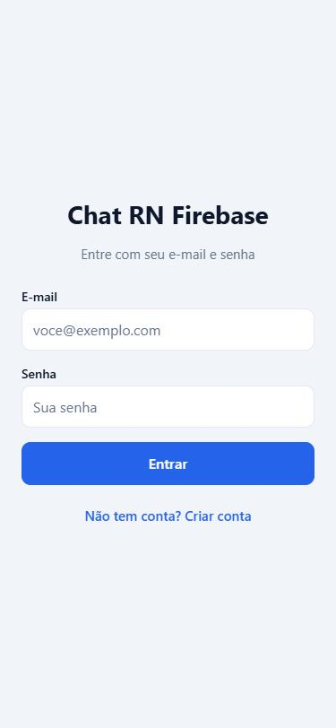
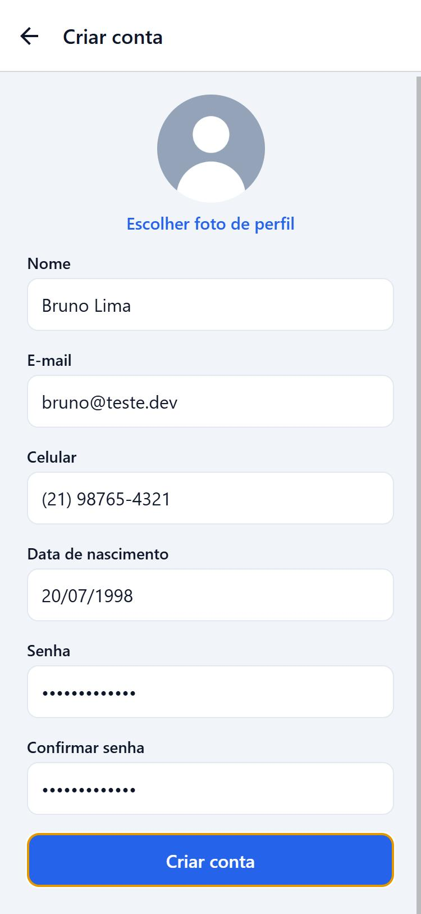
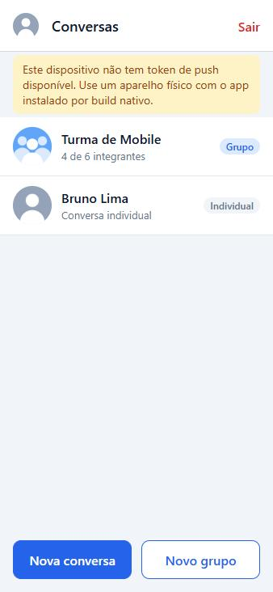
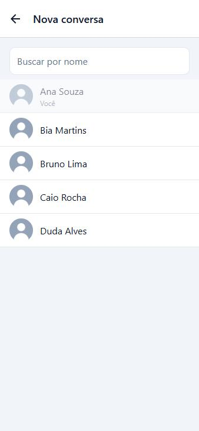
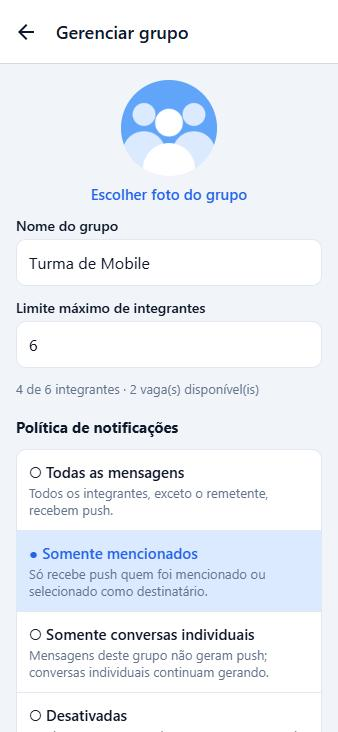
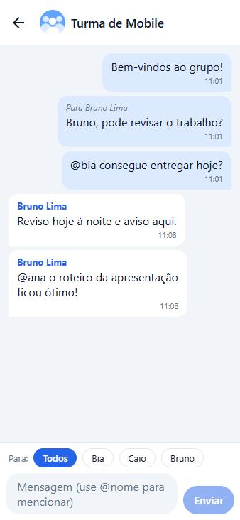
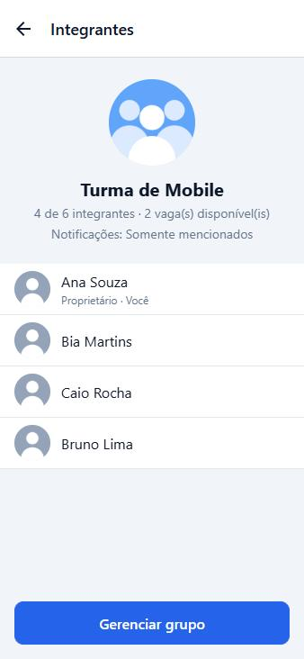
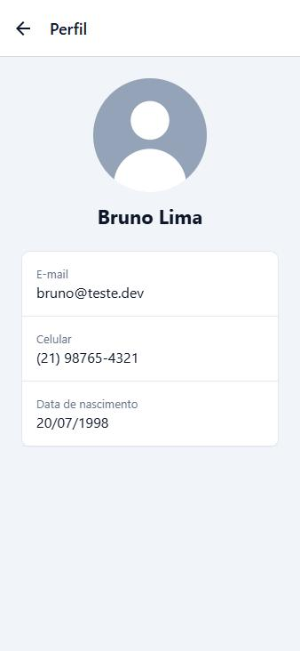
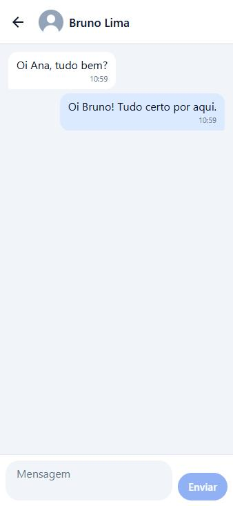

# Chat RN Firebase

Aplicativo de chat em **React Native + Expo + TypeScript** com conversas individuais e em grupo, mensagens em tempo real e notificações push enviadas por uma API própria. O backend é o Firebase: Authentication, Realtime Database, Cloud Firestore e Cloud Messaging.

## Integrantes

- RM555185 — Guilherme Barbiero
- RM556818 — Marco Antonio Gonçalves
- RM556137 — Vinicius Castro
- RM555418 — Camila Mie Takara
- RM558479 — Matheus Cantiere

## Sumário

1. [Tecnologias](#tecnologias)
2. [Serviços Firebase e responsabilidade de cada um](#serviços-firebase-e-responsabilidade-de-cada-um)
3. [Instalação e execução do aplicativo](#instalação-e-execução-do-aplicativo)
4. [Configuração do Firebase](#configuração-do-firebase)
5. [Armazenamento das fotos (Cloudinary)](#armazenamento-das-fotos-cloudinary)
6. [Notificações no Android e no iOS](#notificações-no-android-e-no-ios)
7. [API online](#api-online)
8. [Política de notificações](#política-de-notificações)
9. [Limite do grupo e proteção contra concorrência](#limite-do-grupo-e-proteção-contra-concorrência)
10. [Regras de segurança](#regras-de-segurança)
11. [Estrutura do projeto](#estrutura-do-projeto)
12. [Testes](#testes)
13. [Prints das telas](#prints-das-telas)
14. [Evidência de notificação recebida](#evidência-de-notificação-recebida)

## Tecnologias

| Camada | Tecnologia |
| --- | --- |
| App | React Native 0.86, **Expo SDK 57**, TypeScript 6 (modo `strict`, sem `any`) |
| Navegação | React Navigation 7 (native stack) com parâmetros tipados |
| Firebase no app | Firebase JS SDK 13 (Authentication, Cloud Firestore, Realtime Database) |
| Push no app | `expo-notifications` (token nativo do FCM no Android) |
| Fotos | `expo-image-picker` + Cloudinary |
| API | Node.js 22, Express 5, TypeScript, Firebase Admin SDK 14 |
| Hospedagem da API | Render (Web Service) |

Hooks usados com finalidade real: `useState` (formulários e estados de tela), `useEffect` (listeners em tempo real com limpeza), `useMemo` (listas derivadas: conversas ordenadas, busca de usuários, integrantes) e `useCallback` (assinaturas estáveis de listeners e handlers de listas). Hooks próprios: `useAuth`, `useChat`, `useGroups`, `useUsers`, `useConversations`, `useNotifications`, `useConnectivity` e `useListener`.

## Serviços Firebase e responsabilidade de cada um

| Serviço | Responsabilidade neste projeto |
| --- | --- |
| **Firebase Authentication** | Cadastro e login **somente com e-mail e senha**, recuperação da sessão ao reabrir o app, identificação por `uid` e logout. O ID token autentica as chamadas à API. |
| **Realtime Database** | **Todas as mensagens** (individuais e de grupo) em `messages/{conversationId}/{messageId}`, com listeners em tempo real nas conversas abertas. Guarda também `groupMembers/{groupId}/{uid}`, um espelho dos integrantes gravado só pela API, usado pelas regras para liberar leitura e envio. |
| **Cloud Firestore** | Perfis (`users`, `publicProfiles`), tokens de dispositivos (`users/{uid}/devices`), conversas individuais (`directConversations`), grupos com integrantes, limite e política de notificações (`groups`), além de dois índices internos da API (`userGroups`, `pushReceipts`). |
| **Cloud Messaging (FCM)** | Entrega dos pushes no Android, enviados pela API com o Admin SDK (HTTP v1). O payload leva `conversationId` e `conversationType` para o app abrir a conversa certa. |

### Modelo de dados

**Cloud Firestore**

```
publicProfiles/{uid}          name, photoUrl                      (lista de usuários)
users/{uid}                   name, email, phoneNumber, birthDate, photoUrl, createdAt
users/{uid}/devices/{id}      token, platform, enabled, updatedAt
directConversations/{a_b}     participantIds [a, b], createdAt    (id = os dois uid ordenados)
groups/{groupId}              name, photoUrl, ownerId, memberIds, memberLimit,
                              notificationPolicy, createdAt, updatedAt
userGroups/{uid}              groupIds                            (índice interno da API)
pushReceipts/{conv_msg}       senderId, createdAt                 (idempotência do push)
```

**Realtime Database**

```
messages/{conversationId}/{messageId}
    conversationType, senderId, text, target, mentionedUserIds, createdAt
groupMembers/{groupId}/{uid}: true        (espelho gravado só pela API)
```

O perfil é dividido em dois documentos de propósito: a tela de usuários precisa listar todo mundo, mas os dados cadastrais (e-mail, celular, nascimento) só podem ser vistos por quem compartilha uma conversa ou um grupo. `publicProfiles` tem apenas nome e foto; `users` tem o cadastro completo e é protegido pelas regras.

### Por que parte das validações fica na API

Os dados estão divididos entre dois bancos, e as regras de um não enxergam o outro: as regras do Realtime Database não conseguem ler o documento do grupo no Firestore para saber quem é integrante, proprietário ou qual é o limite. Por isso, **toda escrita em grupo passa pela API**:

- criar grupo, alterar nome/foto/limite/política, adicionar e remover integrantes;
- a API valida proprietário e capacidade em uma transação do Firestore e, em seguida, espelha os integrantes em `groupMembers` no Realtime Database;
- as regras do Firestore negam qualquer escrita de cliente em `groups/`, e as do Realtime Database negam qualquer escrita de cliente em `groupMembers/`.

Conversas individuais e mensagens não dependem da API: o id da conversa (`uidA_uidB`) já diz quem participa, então as regras dos dois bancos validam tudo sozinhas.

## Instalação e execução do aplicativo

Pré-requisitos: Node.js 22 ou superior e uma conta Expo (gratuita) para gerar o build.

```bash
git clone <url-do-repositorio>
cd <pasta-do-repositorio>
npm install
```

O push depende de módulos nativos e do `google-services.json`, então **não funciona no Expo Go** (desde o SDK 53). Use um build nativo:

```bash
npx eas-cli@latest login
npx eas-cli@latest init
npx eas-cli@latest build --platform android --profile preview
```

O perfil `preview` gera um APK instalável direto no aparelho. Para desenvolver com recarregamento rápido, use o perfil `development` (development build) e depois:

```bash
npx expo start --dev-client
```

Para conferir tipos:

```bash
npx tsc --noEmit
```

As demais funcionalidades (login, conversas, grupos, mensagens em tempo real) também rodam no navegador com `npx expo start --web`, o que é útil para desenvolver; nesse caso a tela de conversas avisa que o dispositivo não tem token de push.

### Variáveis de ambiente do app

Nenhuma é obrigatória: os valores públicos ficam em [src/config.ts](src/config.ts). Para sobrescrever, copie [.env.example](.env.example) para `.env`.

| Variável | Para que serve |
| --- | --- |
| `EXPO_PUBLIC_API_URL` | URL pública da API |
| `EXPO_PUBLIC_CLOUDINARY_CLOUD_NAME` | Cloud name do Cloudinary |
| `EXPO_PUBLIC_CLOUDINARY_UPLOAD_PRESET` | Upload preset (unsigned) do Cloudinary |
| `EXPO_PUBLIC_EMULATOR_HOST` | Host dos emuladores do Firebase, só em desenvolvimento |

## Configuração do Firebase

O projeto usado é o `chat-rn-firebase-a38c7`. A configuração do SDK cliente está em [firebaseConfig.json](firebaseConfig.json) (somente identificadores públicos) e é carregada em [src/services/firebase.ts](src/services/firebase.ts).

Para reproduzir em outro projeto Firebase:

1. Crie o projeto no [console do Firebase](https://console.firebase.google.com).
2. **Authentication** → Método de login → ative apenas **E-mail/senha**.
3. **Firestore Database** → criar banco de dados em modo de produção.
4. **Realtime Database** → criar banco de dados em modo bloqueado.
5. Configurações do projeto → adicione um app **Web** e copie o objeto para `firebaseConfig.json`.
6. Adicione um app **Android** com o pacote `com.chatrnfirebase.app` e salve o `google-services.json` na raiz do repositório.
7. Publique as regras versionadas neste repositório:

```bash
npx firebase-tools login
npx firebase-tools deploy --only firestore:rules,database --project <seu-project-id>
```

`firebaseConfig.json` e `google-services.json` identificam o projeto para o SDK cliente e não concedem privilégio administrativo. Nenhuma conta de serviço ou chave privada está no repositório.

## Armazenamento das fotos (Cloudinary)

O Firebase Storage exige o plano Blaze, então as fotos de perfil e de grupo ficam no **Cloudinary** (plano gratuito). Fluxo:

1. o usuário escolhe a imagem na galeria (`expo-image-picker`); o app pede a permissão de fotos e avisa se ela for negada;
2. o app envia o arquivo ao Cloudinary ([src/services/storageService.ts](src/services/storageService.ts));
3. **somente a URL `https` devolvida** é gravada no Firestore (`photoUrl`).

Imagens em Base64 nunca vão para os bancos: as regras do Firestore e a API só aceitam `photoUrl` vazio ou começando com `https://`. Quando não há foto ou ela falha ao carregar, o componente [Avatar](src/components/Avatar.tsx) mostra uma imagem padrão.

O app entregue já está configurado: cloud name `qepoxwoi` e upload preset `chat_unsigned`. Para usar outra conta:

1. Crie uma conta em [cloudinary.com](https://cloudinary.com) e anote o **Cloud name**.
2. Em Settings → Upload → Upload presets, crie um preset com **Signing mode: Unsigned** chamado `chat_unsigned`. Recomendado: restringir a formatos de imagem e limitar o tamanho.
3. Informe o cloud name em `src/config.ts` (ou em `EXPO_PUBLIC_CLOUDINARY_CLOUD_NAME`).

## Notificações no Android e no iOS

O app pede a permissão de notificações, obtém o token do dispositivo e o grava em `users/{uid}/devices/{deviceId}` ([src/services/notificationService.ts](src/services/notificationService.ts)). O documento é atualizado quando o sistema troca o token e é apagado no logout. O envio nunca acontece no app: é sempre a API.

### Android

- O token é o **token nativo do FCM** (`getDevicePushTokenAsync`), e a API envia direto pelo Firebase Cloud Messaging.
- `google-services.json` na raiz, referenciado em `app.json` (`android.googleServicesFile`).
- O plugin `expo-notifications` em `app.json` define ícone, cor e o canal padrão `messages`; o app cria esse canal antes de pedir a permissão (necessário no Android 13+).
- É preciso um aparelho físico (ou emulador com Google Play Services) com o app instalado por build nativo.

### iOS

- O token é o do **Expo Push Service** (`getExpoPushTokenAsync`), que entrega via APNs; a API envia para o Expo quando `platform` é `ios`.
- Requer conta no Apple Developer Program: ao rodar `eas build --platform ios`, o EAS cria a chave de push (APNs) e o `projectId` gravado por `eas init` é usado para gerar o token.
- Push não funciona no simulador do iOS; é preciso um aparelho físico.

### Comportamento

- Com o app em segundo plano ou fechado, o sistema exibe a notificação. Ao tocar nela, o app lê `conversationId` e `conversationType` do payload e abre a conversa correspondente.
- Com o app aberto, a notificação aparece como banner, exceto se a conversa dela já estiver na tela.
- O texto do push não inclui o conteúdo da mensagem, apenas quem enviou e em qual conversa.
- Se a permissão for negada ou o dispositivo não tiver token, a tela de conversas mostra um aviso e o restante do app continua funcionando.

## API online

**URL pública:** https://chat-rn-firebase-api.onrender.com

Tecnologia: **Node.js + Express + TypeScript**, com o **Firebase Admin SDK** para validar o ID token, ler o Firestore e o Realtime Database e enviar pelo FCM. Código em [server/](server/).

### Verificar a disponibilidade

```bash
curl https://chat-rn-firebase-api.onrender.com/health
```

Resposta esperada: `{"status":"ok","uptimeSeconds":123,"timestamp":"..."}`.

O plano gratuito do Render suspende o serviço após 15 minutos sem requisições, e a primeira chamada depois disso pode levar cerca de um minuto. Para reduzir esse efeito, o app chama `/health` ao abrir e o workflow [.github/workflows/keep-alive.yml](.github/workflows/keep-alive.yml) faz o mesmo a cada 10 minutos.

### Endpoints

Todos, exceto `/` e `/health`, exigem `Authorization: Bearer <Firebase ID token>`. Erros voltam como `{ "error": "mensagem" }`.

| Método e rota | Corpo | O que faz |
| --- | --- | --- |
| `GET /health` | — | Health check público. |
| `POST /notifications/messages` | `{ conversationId, messageId }` | Confere a mensagem e envia o push aos destinatários permitidos. |
| `POST /groups` | `{ name, photoUrl, memberLimit, notificationPolicy, memberIds }` | Cria o grupo; quem chama vira proprietário. Devolve `{ id }`. |
| `PATCH /groups/:groupId` | qualquer subconjunto de `name`, `photoUrl`, `memberLimit`, `notificationPolicy` | Altera configurações. Somente o proprietário. |
| `POST /groups/:groupId/members` | `{ memberId }` | Adiciona integrante respeitando o limite. Somente o proprietário. |
| `DELETE /groups/:groupId/members/:memberId` | — | Remove integrante e revoga o acesso às mensagens. Somente o proprietário. |

### Fluxo de `POST /notifications/messages`

1. O middleware valida o ID token com o Admin SDK e aceita apenas contas de e-mail e senha.
2. A API lê a mensagem em `messages/{conversationId}/{messageId}` no Realtime Database: precisa existir e o `senderId` precisa ser o usuário autenticado.
3. A conversa é lida no Firestore (`directConversations` ou `groups`) e o remetente precisa ser participante.
4. **Idempotência:** a API cria `pushReceipts/{conversationId}_{messageId}` com `create()`, que falha se o documento já existir. Reenviar a mesma requisição devolve `{ "status": "duplicate" }` sem novo push.
5. Os destinatários são **calculados no servidor** ([recipientResolver.ts](server/src/services/recipientResolver.ts)) a partir dos participantes e da política lidos do Firestore. O corpo da requisição não aceita lista de destinatários.
6. Os tokens ativos de cada destinatário são lidos em `users/{uid}/devices` e o push é enviado: FCM para Android e Expo Push Service para iOS.
7. Tokens recusados como inválidos pelo provedor são **removidos** do Firestore.

A resposta informa `status` (`sent`, `skipped` ou `duplicate`), `recipients`, `sent` e `failed`.

### Executar localmente

```bash
cd server
npm install
cp .env.example .env   # preencha com a conta de serviço; o arquivo .env não é versionado
npm run dev
```

| Variável | Descrição |
| --- | --- |
| `FIREBASE_PROJECT_ID` | Id do projeto Firebase |
| `FIREBASE_DATABASE_URL` | URL do Realtime Database |
| `FIREBASE_CLIENT_EMAIL` | E-mail da conta de serviço (**segredo**) |
| `FIREBASE_PRIVATE_KEY` | Chave privada da conta de serviço (**segredo**) |
| `PORT` | Porta HTTP (o Render define sozinho) |

### Publicar no Render

1. No painel do Render: **New → Blueprint** e selecione este repositório. O arquivo [render.yaml](render.yaml) já descreve o serviço (pasta `server/`, build, start e health check).
2. O Render pede os dois segredos: `FIREBASE_CLIENT_EMAIL` e `FIREBASE_PRIVATE_KEY`. São os campos `client_email` e `private_key` do arquivo JSON da chave de uma conta de serviço do projeto (veja abaixo).
3. Depois do deploy, confirme com `/health` e, se a URL for diferente da documentada, atualize `src/config.ts` e a variável `API_URL` do workflow.

**Conta de serviço com o menor privilégio.** Em vez da conta padrão `firebase-adminsdk` (que tem permissões amplas), crie uma conta dedicada no [Google Cloud IAM](https://console.cloud.google.com/iam-admin/serviceaccounts) do projeto com apenas estes papéis e gere a chave JSON dela:

| Papel | Para quê |
| --- | --- |
| Cloud Datastore User | Ler e gravar no Firestore |
| Firebase Realtime Database Admin | Ler as mensagens e gravar o espelho de integrantes |
| Firebase Cloud Messaging API Admin | Enviar os pushes |

A validação do ID token não exige papel adicional. As credenciais administrativas existem **somente** nas variáveis secretas da hospedagem; o arquivo JSON da chave não deve ser guardado depois de configurado.

## Política de notificações

Cada grupo tem uma `notificationPolicy`, definida na criação e alterável pelo proprietário na tela de gerenciamento.

| Política | Quem recebe o push de uma mensagem do grupo |
| --- | --- |
| `all_group_messages` | Todos os integrantes, exceto o remetente. |
| `mentioned_members` | Somente quem foi mencionado com `@nome` ou selecionado em "Para:" no campo de mensagem. Mensagem geral sem menção não notifica ninguém. |
| `direct_messages_only` | Ninguém: mensagens deste grupo não geram push. Conversas individuais continuam notificando. |
| `disabled` | Ninguém: nenhuma mensagem desta conversa gera push. |

Regras que valem sempre:

- o remetente nunca recebe push da própria mensagem;
- só participantes da conversa podem receber;
- em conversa individual, o outro participante é sempre notificado;
- uma mensagem direcionada a um integrante continua no histórico do grupo, visível a todos; a política decide apenas quem é notificado.

No chat de grupo, a linha "Para:" permite escolher um integrante como destinatário (`target`), e escrever `@PrimeiroNome` no texto preenche `mentionedUserIds`.

## Limite do grupo e proteção contra concorrência

- O limite (`memberLimit`) é definido na criação, precisa ser um inteiro entre 2 e 100 e inclui o proprietário.
- A tela do grupo mostra a quantidade atual e as vagas disponíveis, e avisa quando o grupo está sem vagas.
- O proprietário pode alterar o limite, mas nunca para menos que a quantidade atual de integrantes.
- A validação existe na interface ([groupValidation.ts](src/utils/groupValidation.ts)) e na API ([groupService.ts](server/src/services/groupService.ts)).

Desabilitar o botão não basta, então a decisão final é da API, dentro de uma **transação do Firestore**:

1. a transação lê o documento do grupo;
2. confere se quem pede é o proprietário e se `memberIds.length < memberLimit`;
3. grava a nova lista de integrantes.

O Firestore garante que, se duas transações lerem o mesmo documento e uma delas gravar, a outra é refeita com o dado atualizado. Assim, duas inclusões simultâneas nunca enxergam a mesma vaga: a segunda relê o grupo já cheio e é recusada com HTTP 409. Como o cliente não tem permissão de escrita em `groups/`, não há como contornar a transação.

O teste de integração dispara 10 inclusões simultâneas em um grupo com poucas vagas e confirma que só as vagas disponíveis são preenchidas (veja [Testes](#testes)).

## Regras de segurança

Arquivos versionados: [firestore.rules](firestore.rules) e [database.rules.json](database.rules.json).

**Firestore**

- Tudo exige usuário autenticado **por e-mail e senha**.
- `publicProfiles/{uid}`: qualquer autenticado lê; só o dono grava (nome e foto).
- `users/{uid}`: só o dono ou quem compartilha uma conversa individual ou um grupo com ele consegue ler. Não há permissão de listagem, então ninguém varre os cadastros.
- `users/{uid}/devices`: somente o dono lê e grava; tokens nunca ficam públicos.
- `directConversations/{id}`: só os participantes leem. A criação exige exatamente dois participantes distintos, em ordem, com o id derivado deles, o que impede conversa consigo mesmo e duas conversas para o mesmo par.
- `groups/{id}`: só integrantes leem; nenhum cliente grava.
- `photoUrl` precisa ser vazio ou `https://`, o que barra Base64.

**Realtime Database**

- `messages/{conversationId}`: lê e envia quem participa da conversa. Em conversa individual, o `uid` precisa fazer parte do id; em grupo, precisa existir `groupMembers/{groupId}/{uid}`.
- O `senderId` tem de ser o `uid` autenticado e o `createdAt` tem de ser o horário do servidor.
- Mensagens são imutáveis: não podem ser editadas nem apagadas pelo cliente.
- Destinatário e menções precisam ser integrantes do grupo; campos desconhecidos são rejeitados.
- `groupMembers` não pode ser lido nem gravado por clientes.
- Um integrante removido perde o acesso na hora: novas leituras e envios são negados e o listener que estava aberto é cancelado pelo servidor.

Nenhuma regra é aberta (`".read": true`).

## Estrutura do projeto

```
App.tsx                       ponto de entrada
firebaseConfig.json           configuração do SDK cliente
google-services.json          configuração do app Android (FCM)
firestore.rules               regras do Cloud Firestore
database.rules.json           regras do Realtime Database
firebase.json                 regras e emuladores
render.yaml                   blueprint da API no Render
src/
  components/                 Avatar, ChatMessage, ChatInput, ConversationItem, GroupMemberItem,
                              Loading, ErrorMessage, EmptyState, OfflineBanner, TextField, PrimaryButton
  screens/                    Login, Register, Conversations, Users, GroupForm, GroupMembers, Chat, Profile
  services/                   firebase, authService, userService, chatService, groupService,
                              notificationService, storageService, api
  hooks/                      useAuth, useChat, useGroups, useUsers, useConversations,
                              useNotifications, useConnectivity, useListener
  contexts/                   AuthContext
  navigation/                 RootNavigator e tipos das rotas
  types/                      user, chat, group, notification
  utils/                      conversationId, groupValidation, userValidation, mentions, errors
server/
  src/
    app.ts                    Express, health check e tratamento de erros
    middleware/authenticate.ts
    routes/                   notifications.ts, groups.ts
    services/                 firebaseAdmin, notificationSender, recipientResolver, groupService
    validation.ts, types.ts
  scripts/emulator-check.ts   teste de integração contra os emuladores
```

## Testes

Testes unitários das políticas de destinatários:

```bash
cd server
npm test
```

Teste de integração contra os emuladores do Firebase (requer Java 21 ou superior). Ele exercita as regras dos dois bancos com usuários reais do emulador, os endpoints da API, as quatro políticas de notificação, a idempotência do push, a remoção de integrante e o limite do grupo sob concorrência:

```bash
# terminal 1, na raiz
npx firebase-tools emulators:start --only auth,firestore,database

# terminal 2
cd server
npm run test:emulators
```

## Prints das telas

Capturados com dados de teste nos emuladores do Firebase.

| Login | Cadastro | Conversas |
| --- | --- | --- |
|  |  |  |

| Usuários | Criação/edição de grupo | Chat em grupo |
| --- | --- | --- |
|  |  |  |

| Integrantes do grupo | Perfil | Chat individual |
| --- | --- | --- |
|  |  |  |

## Evidência de notificação recebida


